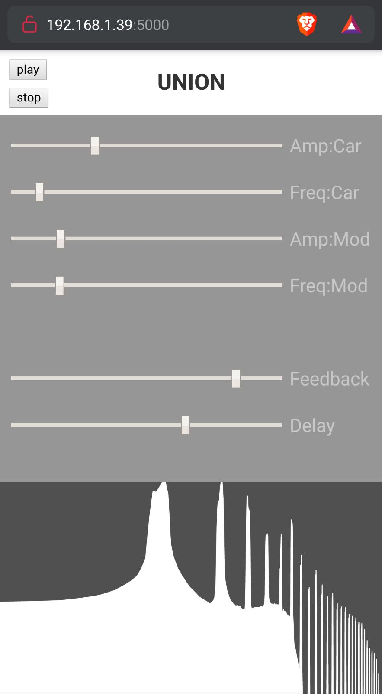

# UNION- Synthesizer

> A synthesizer in the crowd with webaudio.

This project aims to quickly deploy an FM synthesizer in a master class to explain its concept.

The synthesizer is coded in web-audio and is integrated in a web server. The user only has to connect to a server via his mobile phone in order to access to the FM synthesizer. The sound is generated directly by the smart-phone.

This synthesizer can also be used to play several participants simultaneously. 

## Overview

This synthesizer is made with [p5js](https://p5js.org/). It is a simple **FM** synthesizer with full control through a **reverb** and **feedback**. The interface consists of two parts, an upper part to control the synthesizer and a lower part to display the spectrum logarithmically.

## Install and setup

In order to get it run you just have to enter this command in your terminal.
`cd  src_union`
`npm install`
`npm run dev`

Then connect your smart-phone to the given IP. (by `npm run dev`)

## Getting started

- Clone the repository :

  `git clone https://github.com/fouVReaux/UNION.git `

- go to the `src_union` directory : `cd src_union`
- run the `npm install` command
- run the `npm run dev`

## License

[MIT](LICENSE)
