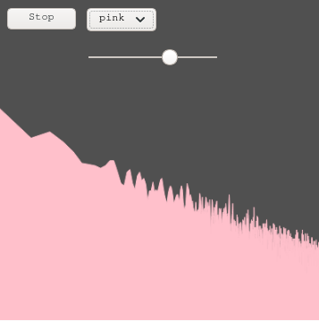
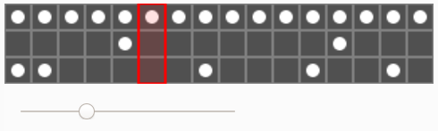
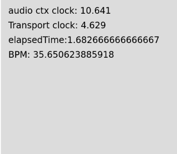

# Tutorial - Web Audio

This repertory contain all tutorial used in order to achieve the UNION project.
With them you can start programming some web audio from scratch.

## The Audio Programmer - Web audio

Tutorial from the youtube channel "The Audio Programmer" by **Dan Tramte**

### Notes

Use of P5js library : https://p5js.org/
And P5js Editor : https://editor.p5js.org/

### First Part : noise generator : [code](./1-mrNoisy/)

- [Browser Noise: Web Audio Tutorial 00 (Introduction)](https://youtu.be/mmluIbsmvoY?list=PLLgJJsrdwhPywJe2TmMzYNKHdIZ3PASbr)
- [Browser Noise: Web Audio Tutorial 01 (Make Noise in less than 1 Minute!)](https://youtu.be/Rpl2-BEsX5M?list=PLLgJJsrdwhPywJe2TmMzYNKHdIZ3PASbr)
- [Browser Noise: Web Audio Tutorial 02 (Button Event Listener)](https://youtu.be/OjBcx7OVdCI?list=PLLgJJsrdwhPywJe2TmMzYNKHdIZ3PASbr)
- [Browser Noise: Web Audio Tutorial 03 (Control Amp and Noise Type)](https://youtu.be/wJr5h5wjkoc?list=PLLgJJsrdwhPywJe2TmMzYNKHdIZ3PASbr)
- [Browser Noise: Web Audio Tutorial 04 (What Is Even Noise?)](https://youtu.be/u_atkqBViN4?list=PLLgJJsrdwhPywJe2TmMzYNKHdIZ3PASbr)
- [Browser Noise: Web Audio Tutorial 05 (Plotting Audio Spectrum)](https://youtu.be/kusyCuMPrFc?list=PLLgJJsrdwhPywJe2TmMzYNKHdIZ3PASbr)
- [Browser Noise: Web Audio Tutorial 06 (Compensating for Logarithmic Hearing)](https://youtu.be/GLOZMmT5Oz4?list=PLLgJJsrdwhPywJe2TmMzYNKHdIZ3PASbr)
- [Browser Noise: Web Audio Tutorial 07 (fill and color spectrum shape)](https://youtu.be/bNXDC2lrm4U?list=PLLgJJsrdwhPywJe2TmMzYNKHdIZ3PASbr)

### Second Part : Drum Machine : [code](./2-DrumMachine/)

- [Browser Noise: Web Audio Tutorial 8 (Simple Drum Machine)](https://youtu.be/oh99SrpXrjg?list=PLLgJJsrdwhPywJe2TmMzYNKHdIZ3PASbr)
- [Browser Noise: Web Audio Tutorial 9 (Adding More Drums)](https://youtu.be/eomGEYs-J08?list=PLLgJJsrdwhPywJe2TmMzYNKHdIZ3PASbr)
- [Browser Noise: Web Audio Tutorial 10 (Creating a User Interface for Our Drum Machine)](https://youtu.be/Oe375jjE-q8?list=PLLgJJsrdwhPywJe2TmMzYNKHdIZ3PASbr)
- [Browser Noise: Web Audio Tutorial 11 (Adding Drum Machine Control)](https://youtu.be/hP01m_gX7Uw?list=PLLgJJsrdwhPywJe2TmMzYNKHdIZ3PASbr)
- [Browser Noise: Web Audio Tutorial 12 (Animating the Playhead)](https://youtu.be/fRT3ryGz1F4?list=PLLgJJsrdwhPywJe2TmMzYNKHdIZ3PASbr)
- [Browser Noise: Web Audio Tutorial 13 (Basic Drum Synthesis)](https://youtu.be/GeEuRS6x6vM?list=PLLgJJsrdwhPywJe2TmMzYNKHdIZ3PASbr)
- [Browser Noise: Web Audio Tutorial 14 (creating effects)](https://youtu.be/DZlQLRps1r8?list=PLLgJJsrdwhPywJe2TmMzYNKHdIZ3PASbr)

### Third Part : Node.Js : [code](./3-ToneJS/)

- [Browser Noise: Web Audio Tutorial 15 (Introduction to Tone.js)](https://youtu.be/8u1aQdG5Nrk?list=PLLgJJsrdwhPywJe2TmMzYNKHdIZ3PASbr)
- [Browser Noise: Web Audio Tutorial 16 (Data Types in Tone.js)](https://youtu.be/W3--FZ8X9lM?list=PLLgJJsrdwhPywJe2TmMzYNKHdIZ3PASbr)
- [Browser Noise: Web Audio Tutorial 17 (Tone.js Synthesizers)](https://youtu.be/GOWj4IVpcag?list=PLLgJJsrdwhPywJe2TmMzYNKHdIZ3PASbr)

### Fourth Part :  Web Audio clocks : [code](./4-TapMetronome/)

- [Browser Noise: Web Audio Tutorial 18 (tap metronome in tone.js)](https://youtu.be/31Qm_upl8kU?list=PLLgJJsrdwhPywJe2TmMzYNKHdIZ3PASbr)

## IRCAM Tutorial:

Tutorial from the ATIAM lectures

### Fifth Part : KaosPad [code](./5-KaosPad/)

This tutorial is from the IRCAM tutorial : [WebAudioMidi-Exercices-ATIAM ](https://github.com/Ircam-Web/WebAudioMidi-Exercices-ATIAM)

### Sixth Part : DrumPad : [code](./6-DrumPad/)

This tutorial is from the IRCAM tutorial : [WebAudioMidi-Exercices-ATIAM ](https://github.com/Ircam-Web/WebAudioMidi-Exercices-ATIAM)

### Seventh Part : Rollup Mini Granular : [code](./7-RollupMiniGranular/)

This tutorial is from the IRCAM tutorial : [WebAudioMidi-Exercices-TP1](https://github.com/b-ma/ATIAM-2019-TP1-boilerplate.git)

### Eighth Part : Distributed DrumMachine : [code](./8-DistributedDrumMachine/)

This tutorial is from the IRCAM tutorial : [WebAudioMidi-Exercices-TP2](https://github.com/b-ma/ATIAM-2019-TP2-boilerplate.git)
